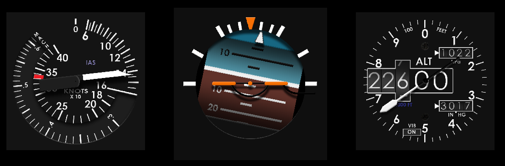

# MICROSOFT FLIGHT SIMULATOR 2020 - INSTRUMENT PANEL



An instrument panel for MS FlightSim 2020. This program is designed to run
on a separate computer to the one running FS2020. It can run on either a PC or a
Raspberry Pi.

This is a work in progress but the idea is to read the variables from the flight
simulator over the network. A small program will be required on the host PC to obtain
these variables using the FS2020 SDK and make them available over the LAN.

The simvars part of this program will be enhanced to read them from the LAN. Currently
the values are just simulated.

This program was heavily inspired by Dave Ault and contains original artwork by him.

  http://www.learjet45chimera.co.uk/
  
  https://hangar45.net/hangar-45-forum/topic/standby-gauge-software-by-dave-ault
  
It has been completely rewritten and updated to use Allegro5. Hopefully,
Allegro5 will support hardware acceleration on the Raspberry Pi 4 soon!

NOTE: Allegro5 must be built on RasPi4 as a standard Linux build, not the
specific Raspberry Pi build, i.e.:
```
  mkdir build
  cd allegro5/build
  cmake .. -DCMAKE_BUILD_TYPE=Release
  make && sudo make install
```
### KEYS
```
p ........ Adjust position and size of individual instruments.
v ........ Adjust FlightSim variables. Simulates changes even if no FlightSim connected.
m ........ Move the display to the next monitor if multiple monitors are connected.
s ........ Enable/disable shadows on instruments. Shadows give a more realistic 3D look.
Esc ...... Quit the program.
```
To make adjustments use the arrow keys. Up/down arrows select the previous or next
setting and left/right arrows change the value. You can also use numpad left/right
arrows to make larger adjustments.

You can choose which instruments are included in the panel by setting the Enabled
attribute for each instrument in the settings file:
```
  settings/instrument-panel.json
```
On Raspberry Pi you can configure hardware Rotary Encoders for each instrument.

 Physical Pin to BCM GPIO
  3  5  7 11 13 15 19 21 23 29 31 33 35 37
  |  |  |  |  |  |  |  |  |  |  |  |  |  |
  2  3  4 17 27 22 10  9 11  5  6 13 19 26

 Physical Pin to BCM GPIO (avoid 8=14, 10=15 and 12=18)
  8 10 12 16 18 22 24 26 32 36 38 40
  |  |  |  |  |  |  |  |  |  |  |  |
 14 15 18 23 24 25  8  7 12 16 20 21

Each rotary encoder is connected to two BCM GPIO pins (+ ground on centre pin).
See individual instruments for pins used. Not all instruments have manual controls.

Note: pullUpDnControl does not work on RasPi4 so have to use raspi-gpio command-line
to pull up resistors.

# Donate

If you find this project useful, would like to see it developed further or would just like to buy the author a beer, please consider a small donation.

[](https://paypal.me/scottvincent2020)
